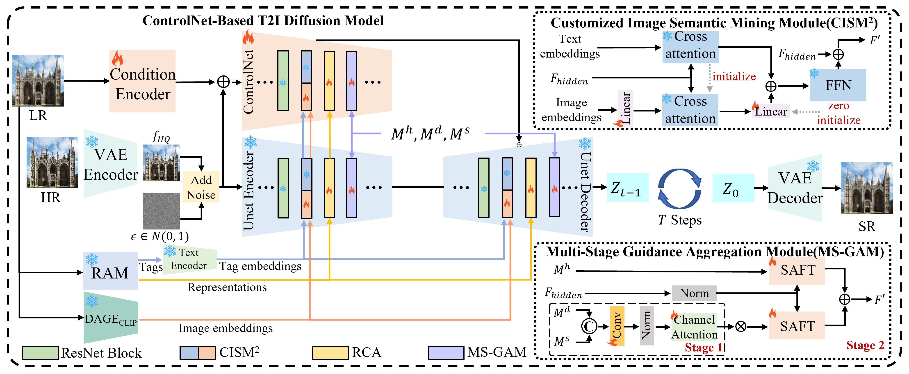

# MegaSR: Mining Customized Semantics and Expressive Guidance for Image Super-Resolution

  

This is the official repository for "MegaSR: Mining Customized Semantics and Expressive Guidance for Image Super-Resolution."

## :bookmark: Updates
- [x] 2025-03-12: **Arxiv version has been released.**
